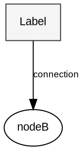

# Technical Diagrams

**CRITICAL RULE: ALWAYS create DOT files before generating diagrams. NEVER rely on auto-generation from ASCII art. Custom DOT files are REQUIRED for professional-quality output.**

Create technical diagrams using either Graphviz DOT or Excalidraw JSON format.

## Format Selection

| Format | Best For | Output |
|--------|----------|--------|
| **Graphviz DOT** | Static diagrams, PDF embedding, precise layouts | PNG, SVG |
| **Excalidraw** | Collaborative editing, hand-drawn aesthetic, version control | .excalidraw JSON |

Ask the user which format they prefer, or default to Excalidraw for architecture diagrams and Graphviz for ER diagrams.

---

# GRAPHVIZ DOT FORMAT

## Quick Start

```bash
# Generate PNG at 150 DPI
dot -Tpng -Gdpi=150 diagram.dot -o diagram.png

# Generate SVG
dot -Tsvg diagram.dot -o diagram.svg
```

## Core DOT Structure



## Color Palette

| Purpose | Fill | Border | Use For |
|---------|------|--------|---------|
| Primary/Clients | #FFFFFF | #2C3E50 | Entry points, users |
| Secondary/Services | #F5F5F5 | #505050 | API layers, services |
| Core Logic | #E8E8E8 | #404040 | Core logic |
| Applications | #FAFAFA | #606060 | Applications |
| Data/Storage | #ECECEC | #303030 | Databases |
| Neutral | #F9F9F9 | #707070 | Backgrounds |

## DOT Templates

See `references/architecture-template.dot`, `references/flowchart-template.dot`, `references/er-diagram-template.dot`, `references/sequence-template.dot`

---

# EXCALIDRAW FORMAT

## Overview

Excalidraw files are JSON with `.excalidraw` extension. They can be opened at excalidraw.com, VS Code Excalidraw extension, or Obsidian plugin.

## File Structure

```json
{
  "type": "excalidraw",
  "version": 2,
  "source": "https://excalidraw.com",
  "elements": [],
  "appState": {
    "gridSize": null,
    "viewBackgroundColor": "#ffffff"
  },
  "files": {}
}
```

## Element Generation Pattern

CRITICAL: Every shape with text requires TWO elements (shape + text) with proper binding.

### Shape with Label (Required Pattern)

```json
[
  {
    "id": "rect-1",
    "type": "rectangle",
    "x": 100,
    "y": 100,
    "width": 150,
    "height": 60,
    "strokeColor": "#404040",
    "backgroundColor": "#f5f5f5",
    "fillStyle": "solid",
    "strokeWidth": 2,
    "roughness": 0,
    "opacity": 100,
    "groupIds": [],
    "roundness": { "type": 2 },
    "boundElements": [
      { "id": "text-1", "type": "text" }
    ],
    "isDeleted": false,
    "seed": 1234567890,
    "version": 1,
    "versionNonce": 1234567890
  },
  {
    "id": "text-1",
    "type": "text",
    "x": 125,
    "y": 115,
    "width": 100,
    "height": 30,
    "text": "API Gateway",
    "fontSize": 16,
    "fontFamily": 1,
    "textAlign": "center",
    "verticalAlign": "middle",
    "containerId": "rect-1",
    "originalText": "API Gateway",
    "strokeColor": "#303030",
    "isDeleted": false,
    "seed": 1234567891,
    "version": 1,
    "versionNonce": 1234567891
  }
]
```

### Arrow with Elbow Routing (90-degree)

For clean diagrams, use elbow arrows with explicit points:

```json
{
  "id": "arrow-1",
  "type": "arrow",
  "x": 250,
  "y": 130,
  "width": 100,
  "height": 0,
  "points": [[0, 0], [50, 0], [50, 50], [100, 50]],
  "strokeColor": "#404040",
  "strokeWidth": 2,
  "roughness": 1,
  "startBinding": { "elementId": "rect-1", "focus": 0, "gap": 5 },
  "endBinding": { "elementId": "rect-2", "focus": 0, "gap": 5 },
  "startArrowhead": null,
  "endArrowhead": "arrow",
  "isDeleted": false,
  "seed": 1234567892,
  "version": 1,
  "versionNonce": 1234567892
}
```

## Element Types

| Type | Use For |
|------|---------|
| `rectangle` | Services, components, boxes |
| `ellipse` | Start/end points, actors |
| `diamond` | Decision points |
| `arrow` | Connections, data flow |
| `line` | Non-directional connections |
| `text` | Labels (standalone or bound) |

## Color Palette (Excalidraw)

| Purpose | Background | Stroke |
|---------|------------|--------|
| Primary/API | #ffffff | #2c3e50 |
| Secondary/Service | #f5f5f5 | #505050 |
| Core Logic | #e8e8e8 | #404040 |
| Applications | #fafafa | #606060 |
| Data/Storage | #ececec | #303030 |
| Neutral | #f9f9f9 | #707070 |

## Required Element Properties

Every element MUST have:
- `id`: Unique string (e.g., "rect-1", "arrow-2")
- `seed`: Random integer for shape rendering
- `version`: Integer (start at 1)
- `versionNonce`: Random integer
- `isDeleted`: false

## ID Generation

```javascript
// Generate unique IDs
function generateId(prefix, index) {
  return `${prefix}-${index}`;
}

// Generate random seed
function generateSeed() {
  return Math.floor(Math.random() * 2147483647);
}
```

## Excalidraw Templates

See `references/excalidraw-architecture.json` for full architecture diagram example.

## Best Practices (Excalidraw)

1. **Use elbow arrows** (90-degree points) for clean routing
2. **Bind text to shapes** using `boundElements` and `containerId`
3. **Color-code by component type** for visual clarity
4. **Use consistent spacing** (e.g., 200px between components horizontally)
5. **Group related elements** with same y-coordinate for alignment
6. **Generate unique seeds** for each element (roughjs rendering)

## Common Issues (Excalidraw)

| Problem | Solution |
|---------|----------|
| Empty boxes (no text) | Add text element with `containerId` pointing to shape |
| Arrows not connecting | Add `startBinding`/`endBinding` with target `elementId` |
| Overlapping arrows | Use elbow points to route around obstacles |
| Text misaligned | Center text x/y within container bounds |

---

## Workflow

1. Ask user for diagram type (architecture, flowchart, ER, sequence)
2. Ask format preference (Graphviz for static/PDF, Excalidraw for editable)
3. Generate diagram file
4. For Graphviz: render with `dot` command
5. For Excalidraw: save as `.excalidraw` file
